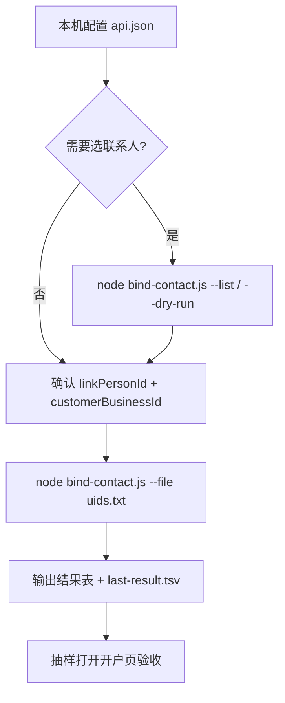

# AMS 账户默认联系人

腾讯广告服务商后台（`e.qq.com`）批量把已有「账户联系人」选中到子客账户——对应开户页「联系人信息 → 账户联系人」，**不是**埋点、也不是「新增联系人」短信链路。

| 原则 | 说明 |
|------|------|
| API 优先 | 一律跑 `scripts/bind-contact.js`，禁止浏览器逐条点 |
| 凭证本机 | Cookie / 执照号只写本机 `api.json`（已 gitignore），禁止贴进聊天或提交仓库 |
| 路径默认 | 默认 `POST /agp/advertiser/update`（审核不通过也可选中）；`--bind-only` 才走 `bind_link_person` |
| 可验收 | 跑完输出结果表；页面打开对应 uid 应看到已绑姓名与手机 |

## 何时启用

- 「批量设默认联系人 / 账户联系人」
- 页面 `advertiser-add-account-am`、字段 `agencyUid` / `link_person_id`
- 需要按 uid 列表批量绑定，而不是开户短信「新增联系人」

## 执行流



## 快速开始

```bash
SKILL_ROOT=.agents/skills/ams-default-contact/scripts
cd "$SKILL_ROOT"

cp api.example.json api.json
# 编辑 api.json：Cookie、agencyUid、linkPersonId、customerBusinessId、uids

node bind-contact.js --list             # 拉可选联系人（需执照号）
node bind-contact.js --dry-run          # 只打印将要绑定的参数，不提交
node bind-contact.js                    # 按 api.json.uids 绑定
node bind-contact.js --file uids.txt    # 用文件覆盖 uid 列表
node bind-contact.js --bind-only        # 改走 bind_link_person（校验账号状态更严）
```

路径也可用个人目录拷贝：`~/.cursor/skills/ams-default-contact/scripts`（与仓库 skill 同源）。

## 用户输入怎么处理

| 输入 | 处理 |
|------|------|
| 账户 uid 列表（空格 / 逗号 / 文件） | 写入 `uids.txt` 或 `api.json.uids` 后执行脚本 |
| 指定联系人姓名 / 手机 | `--list` 打出 `link_person_list`，把 `link_person_id` 写入 `api.json` |
| 已有 Cookie | 写入本机 `api.json.cookie`（整行；勿贴聊天） |
| 「批量设默认联系人」 | 默认：`advertiser/update` 选中；等价页面 `link_person_type=select` |

## 页面文案 ↔ 接口

| 页面文案 | 接口含义 |
|----------|----------|
| 联系人信息 | 区块标题 |
| 账户联系人 | 下拉选已有联系人（本 skill 覆盖） |
| 默认联系人 | 选中并绑定到账户的那条 `link_person_id` |
| 新增联系人 | **不做**（证件 / 短信另一条链路） |

完整字段、`g_tk`、请求体见 [API.md](API.md)。

忽略 Network 里的 `https://e.qq.com/data-report-hub/api`——那是埋点，不是保存接口。

## 接口速查

| 步骤 | Method | Path |
|------|--------|------|
| 拉可选联系人 | GET | `/agp/advertiser/get_binding_link_person_list` |
| 拉账户详情 | GET | `/agp/advertiser/get` |
| **选中账户联系人（默认）** | POST | `/agp/advertiser/update` |
| 编辑联系人弹窗（有效 / 待审核） | POST | `/agp/advertiser/bind_link_person` |

## 执行后输出（必须汇总）

| uid | link_person_id | 状态 | 原因 |
|-----|----------------|------|------|

验收 URL：

```
https://e.qq.com/ams/agency/advertiser-add-account-am?agencyUid={agencyUid}&uid={uid}
```

「账户联系人」应显示已绑姓名和手机。

## 失败处理

| 现象 | 处理 |
|------|------|
| 未找到 `api.json` / cookie 未填 | 引导本机 `cp api.example.json api.json` 并填写 |
| 401 / 登录失效 / code 含登录 | Cookie 过期，重新登录 AMS 后更新 cookie |
| 「请选择联系人」/ 列表空 | 缺 `reg_certification_no` 或该执照下无联系人；先 `--list` |
| 小微账户 | 前端只能「新增联系人」，不要对小微户走 select 绑定 |
| 单条连续失败 2 次 | 记失败表，继续下一条 |

## 禁止

- 把 `data-report-hub` 当业务接口
- 批量场景用浏览器逐条点
- 把 `api.json`、真实 Cookie、执照号、uid 跑批结果提交 Git 或发到外网
- 走「新增联系人」开户短信链路（本 skill 只做已有联系人绑定）
