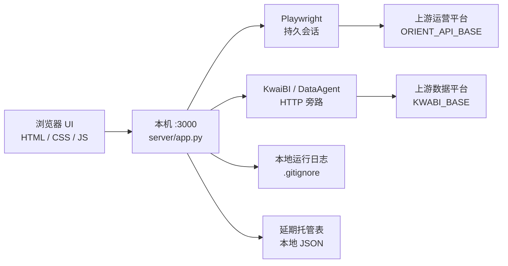

# 联盟诊断工作台

内网策略运营工作台：浏览器只打本机服务，由 Python 代理层统一对接上游运营 / 数据平台。

[功能矩阵](#功能矩阵) · [架构](#架构) · [HTTP API](docs/API.md) · [Agent Skills](#agent-skills) · [启动](#本地启动)

---

## 定位

把「查策略 → 审策略 → 延期托管 → 定投 / 屏蔽」收成一套本机工作台，而不是散落在多个内网页和手工脚本里。

| 原则 | 说明 |
|------|------|
| 本机入口 | 浏览器只访问 `127.0.0.1:3000`（或部署机局域网 `:3000`） |
| 服务端代理 | Orient 会话由 Playwright 持久浏览器维持；前端不持上游 Cookie |
| 凭证不上库 | 真实域名、Token、Cookie 仅本机环境变量 / 本地文件，仓库用占位符 |
| 契约可查 | 对外 HTTP 面见 [`docs/API.md`](docs/API.md) |

---

## 功能矩阵

| 模块 | 状态 | 能力摘要 |
|------|------|----------|
| 工作台首页 | ✅ | 诊断入口、运行日志、会话态侧栏 |
| 策略查询 | ✅ | 开发者 / 广告位 / 应用 ID 实时查定向策略；行业映射 |
| 策略审核 | ✅ | 详情、状态流转、推全、封禁链路、白名单自动审 |
| 策略延期 | ✅ | 单条延期提审 + 托管表扫描守护 |
| 游戏优质媒体定投 | ✅ | 按账户 / 名称拉媒体，批量创建定投 |
| 定向屏蔽 | ✅ | type=7 新建屏蔽（batchAddV2） |
| KwaiBI 数据集 | ✅ | 本机 `/api/dataset/*` 结构化查数 |
| DataAgent | 旁路 | NL 对话代理；前端默认主路径不依赖 |
| 策略效果监控 | 壳 | API 占位（`shell: true`），业务未开放 |
| CPM 等灰显入口 | ⏳ | 产品预留，未实现 |

---

## 架构



**请求包络（统一）**

```json
{ "success": true,  "data": { } }
{ "success": false, "error": "ERROR_CODE", "message": "可读说明" }
```

部分上游业务失败仍可能 HTTP 200，以 `success` / `error` 为准（如 `ORIENT_FAILED`、`COOKIE_EXPIRED`）。

---

## HTTP API（摘要）

完整索引、字段与 curl 示例：[**docs/API.md**](docs/API.md)（与实现同步）。

| 分组 | 代表路径 |
|------|----------|
| 系统 | `GET /api/health` · `GET /api/cookie/status` |
| 日志 | `GET/POST /api/workbench/logs` |
| 查询 | `POST /api/strategy/query` · `POST /api/strategy/industry/map` |
| 详情 / 延期 | `POST /api/strategy/renew/get` · `POST /api/strategy/renew/submit` |
| 审核 | `POST /api/strategy/audit/flow` · `…/batchPass` · `…/auto-approve/*` |
| 延期托管 | `GET/POST /api/strategy/postpone/*` |
| 游戏定投 | `POST /api/strategy/game-premium/*` |
| 定向屏蔽 | `POST /api/strategy/shield-platform/create` |
| 数据集 | `GET /api/dataset/list` · `POST /api/dataset/query` |
| DataAgent | `GET /api/dataagent/status` · `POST /api/dataagent/chat` |

常用请求头（按模块）：`Content-Type`、`X-Postpone-Operator`、`X-Kwabi-Cookie`、`X-DataAgent-Cookie`。

---

## 技术栈

| 层 | 技术 |
|----|------|
| 前端 | 原生 HTML / CSS / JavaScript（无框架打包） |
| 视觉 | 自研布局 + 玻璃拟态主题（`staging-glass.css`） |
| 后端 | Python 3 `http.server` 扩展（`server/app.py` + `server/modules/*`） |
| 会话代理 | Playwright 持久化 Chromium |
| 保活 | `guardian.sh` + `scripts/start-production.sh` |
| 契约 | `docs/API.md` · `docs/ORIENT-CONTRACT.md` · `docs/PRODUCTION-STARTUP.md` |

---

## 地址约定（占位，非真实）

浏览器**只访问本机服务**；真实上游域名与内网 IP **不写进仓库**。

| 用途 | 占位示例 | 说明 |
|------|----------|------|
| 本机工作台 | `http://127.0.0.1:3000` | 默认端口，可改 `PORT` |
| 本机 API | `http://127.0.0.1:3000/api/*` | 前端相对路径 `/api/...` |
| 上游运营平台 | `https://ops-platform.example.corp/rest` | `ORIENT_API_BASE` |
| 上游数据平台 | `https://bi-platform.example.corp` | `KWABI_BASE` |
| 内网入口 | `http://workbench.example.corp:3000` | 部署机局域网，本地配置 |

```bash
export ORIENT_API_BASE="https://ops-platform.example.corp/rest"
export KWABI_BASE="https://bi-platform.example.corp"
export PORT=3000
```

### MCP（可选，占位）

真实 MCP URL / Token 只放本机客户端配置，不进仓库。

| 用途 | 占位 |
|------|------|
| MCP SSE / HTTP | `https://mcp.example.local/sse` |
| 鉴权 | `Authorization: Bearer <LOCAL_TOKEN>` |

---

## Agent Skills

仓库内可复用的 Cursor Agent 技能（契约 + 脚本；凭证不上库）：

| Skill | 说明 |
|-------|------|
| [ams-default-contact](.agents/skills/ams-default-contact/) | 腾讯广告 AMS 批量绑定「账户联系人」——API 优先，禁止浏览器逐条点 |

入口：[SKILL.md](.agents/skills/ams-default-contact/SKILL.md) · [API.md](.agents/skills/ams-default-contact/API.md) · [`bind-contact.js`](.agents/skills/ams-default-contact/scripts/bind-contact.js)

```bash
cd .agents/skills/ams-default-contact/scripts
cp api.example.json api.json   # 本机填 Cookie，勿提交
node bind-contact.js --dry-run
```

## 仓库结构

```
index.html / *.js / *.css     前端模块
server/app.py                 HTTP 入口与路由
server/orient_browser.py      Playwright 代理
server/modules/               查询 · 审核 · 延期 · 定投 · 屏蔽 · 数据集 …
.agents/skills/               Cursor Agent Skills（如 ams-default-contact）
guardian.sh                   生产守护
scripts/                      启动 / 同步 / 运维脚本
docs/                         API · Orient 契约 · 启动约定（地址已脱敏）
```

---

## 本地启动

```bash
bash scripts/start-production.sh
# 或
bash guardian.sh run
```

默认端口 **`3000`**。会话、Cookie、运行日志、托管表等已由 `.gitignore` 排除。

| 文档 | 内容 |
|------|------|
| [docs/API.md](docs/API.md) | HTTP 接口全文（与 PDF「联盟工作台 · API」同源） |
| [docs/ORIENT-CONTRACT.md](docs/ORIENT-CONTRACT.md) | 审核状态机 / Orient 约定 |
| [docs/PRODUCTION-STARTUP.md](docs/PRODUCTION-STARTUP.md) | 生产启动与端口优先级 |

---

> **安全提示**：请勿把真实 Cookie、内网 IP、生产 Token 提交进本仓库。Issue / PR 中同样使用占位地址。
